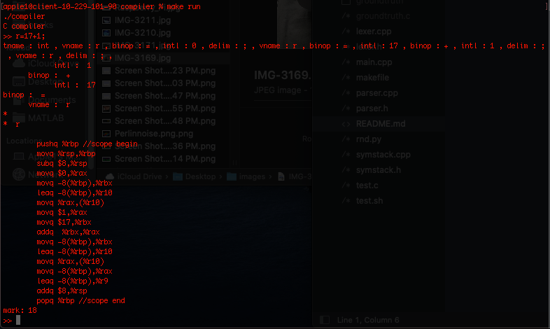

# C Compiler


## Setup

Use `make` to build, the executables is named `compiler`.

This compiler has two modes, shell mode and file mode.
```bash
./compiler #creates a shell
```

```bash
./compiler main.c #creates a gen.s assembly file
```

In this screen shot we can see the compiler being run in
shell mode with `make run`.  At the prompt, I typed in `r=17+1`.
Whatever is stored in the variable "r" is returned by the shell.
The first thing returned is the lexer output, then the abstract
syntax tree, then the generated assembly, and finally, the value
returned by the process we compiled.  The return value is 18 because
we set "r" to equal 17 plus one. 



## Design

This compiler has three stages: lexer, parser, and backend.  The lexer removes comments and excess whitespace, the converts the input string into a vector of tokens.  There are 13 types of tokens including keywords (for,if,break,...), binary operators (+,-,+=,&&,...), and integer literals (17,43,-2344).  Each token type is defined by a regular expression. For example, anything matching `[_a-zA-Z][_a-zA-Z0-9]*` is a variable name token.  The parser takes a vector of tokens a converts it to a binary tree of tokens also know as an abstract syntax tree.  This tree is constructed recursively according to a context free grammar.  The backend takes and abstract syntax tree and generates a string of x86 assembly code.  Each node in the tree has a blob of assembly associated with it.  The backend must walk the tree in a depth first manner and stitch all of these blobs together to create a complete assembly file.

## Features 
* Functions and recursive functions
* If statements
* For and while loops
* All binary operators
* Pointers

## Limitations
* No else statements
* No floating point
* No structs
* All ints are 64-bit
* No terinary operator
* No macros


